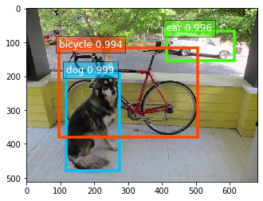

<h1 align='center' style='color:purple'> 人工智慧 進階課程 - Deep Learning- 課程 01 - An Introduction to You Only Look Once (YOLO) - You Only Look Once  (YOLO)  介紹
 - Python Tutorial</h1>
'''

人工智慧- 進階課程

A.I Tutorials - 進階課程 Advanced Course 

- Deep Learning 教程 

''' 05 - 深度學習 教程

         課程 01 - Deep Learning- 
                 - 課程 01 - An Introduction to You Only Look Once  (YOLO)
                     - YOLO 目標檢測 簡介  
                 
                 - 課程 01 - An introduction to YOLO Algorithm
                     - YOLO 演算法 介紹
                 
         程式範例 - YOLO 演算法  目標檢測 - 圖像 
                     - Multi Object Detection  - Images     
            
'''         '''

>> 資料準備

    >> 你我互動學習園地- 進階課程 Advanced Course 
        >> https://interactiveuandmetutorialsac.weebly.com/

    >> 你我互動學習園地
        >> https://interactiveuandmetutorials.weebly.com/
    
    >> Python 程式語言 設計
        >> https://pythonprogrammingtutorials.weebly.com/
 
 
  
>> 目錄結構看起來像這樣:

    >> Deep Learning- 課程 01 - 人工智慧 進階課程 - An Introduction to You Only Look Once  (YOLO) - YOLO 介紹.zip
   

檔案路徑/
    ├── 課程 01 - 人工智慧 進階課程 - An Introduction to You Only Look Once  (YOLO) - YOLO 介紹 ipynb
    └── images/
            └── dog.jpg

    
    
'''   '''

>> YOLO 目標檢測 簡介

    >> Introduction to You Only Look Onc (YOLO) - Object Detection 
    
    >> You Only Look Once (YOLO)這個字
        >> 作者- 取自於 - You Only Live Once
        >> YOLO 是 - One Stage 的 物件偵測方法
        >> 只需要對圖片作一次 - CNN 架構
        >> 便能夠判斷圖形內的物體- 位置 與 類別
            - 提升辨識速度
            
'''
 

 

 
'''

>> 深度學習
    >> 什麼是 One Stage Detection  物件偵測  
    >> 什麼是 Two Stage Detection  物件偵測  
        >> 電腦視覺－ 物件偵測中
        >> 一般作法都是先用 一些特殊方法 － 先選出物件
        >> 如 - Selective Search
        >> 選出物件的過程 稱為 - Region Proposal
            - 然後針對選出的物件 - Region Proposals 
                - 進行物件辨識 - Object Detecion 
            - 因為選出的物件大小 - 可能不一樣
                - 所以物件辨識有可能 - 只有分類
            - 也可能包含 - 特徵擷取
                - 加以分類 Classifcation 
            
        >> 先找出 Region Proposal
            - 再做辨識的做法
                - Two Stage Detection 物件偵測 
                
'''                '''

>> One Stage Detection / Learning - 物件偵測 
   >> 偵測物件位置- 也可以辨識物件
        >> Google - Single Shot Detector (SSD)
   
    >>One Stage Detection / Learning - 物件偵測的方法
    >> 比較 有名的方法 為
        -YOLO (You Only Look Once) 系列: 
                                        - YOLOv1
                                        - YOLOv2
                                        - YOLOv3
                                        - Tiny YOLO
                                        - Single Shot Multi Detection (SSD)
            
'''
 


```python
'''

>> Two Stage Detection / Learning - 物件偵測 
    >> Two Stage 物件偵測的方法 - 比較有名的方法
        - Region-based convolutional neural network
            - R-CNN: Regions with CNN features
            - Fast R-CNN   改良版
            - Faster R-CNN 進化版
            
'''
```

 
'''

>> R-CNN, fast R-CNN, and faster R-CNN - 差異 比較

'''
 


```python

```
'''

>> YOLO 物體偵測 (Object Recognition/ Object Detection) 演算法- 介紹 
    >> 物體檢測歷史 (Object Recognition/ Object Detection)
        >  2001 - 2017 - ~ 
        
''''''

>> 2001 - 第一個高效的人臉檢測器 (Viola-Jones Algorithm)
    >> Paul Viola＆Michael Jones
        - 發明了一種高效的人臉檢測算法
    >> 演示使用網絡攝像頭上- Live 檢測到人臉
    >> 是當時最令人驚嘆的計算機視覺演示 
        - 及顯露這項技術的潛力
    >> 很快- 被實現在 - OpenCV
    >> 人臉檢測
        - 成為 Viola 和 Jones算法 - 代名詞
    
'''    
 
 
'''

>> 2005 - 更有效的檢測技術 (Histograms of Oriented Gradients)
    >> Navneet Dalal和Bill Triggs為行人檢測發明了“HOG”
    >> 特徵描述符
    >> 方向梯度的直方圖（Histograms of Oriented Gradients - HOG）
        >> 在這項任務中明顯優於當時所有的算法
    >> 圖像特徵
        >> 就像以前一樣仍然是由具有專業圖像知識的資料科學家
            >> 透過特徵工程擷取出來(Handcoded features)
            >> 對於每一個圖像像素 都想看看直接圍繞- 週圍的像素
    
'''    
 
'''

>> 目標是了解與周圍像素相比，當前像素有多暗？
    - 然後繪製一個箭頭，顯示圖像越來越暗的方向：

'''
 
'''

>> 圖像中的每個像素重複這個過程
>> 每個像素都被一個箭頭取代
    >> 這些箭頭被稱為 - 梯度(Gradients) 
    >> 梯度(Gradients)  - 顯示整個圖像中從光線由淺到深的流動

'''
 
'''

>> 把圖像分解成- 16x16 像素 - 小方塊
>> 每個正方形中
    - 將計算每個主要方向上有多少個" 梯度 "點
>> 然後 - 將用最強的箭頭方向 - 替換圖像中的方塊
    >> 最終 - 原始圖像轉化
    >> 為簡單的表示(Representation)形式
        - 以簡單的方式捕捉人臉的基本結構
    >> 檢測面部
        >> 意味著找到圖像中
            >> 看起來與從一堆其他訓練面提取的已知 HOG模式最相似的部分

'''
 


```python

```
'''

>> 成為圖像分類 圖像分析 和分類 - 標準
        
'''  
 


```python

```

 
'''

>> 圖像分析和分類
    >> Image Classification
    >> 分類(image clarification)中
    >> 通常是以單個物體作為焦點的圖像
        - 任務 是說出該圖像是什麼

'''
 

 
'''

>> 但是- 我們看到周圍的世界時 及 我們 執行的任務要複雜得多
>> 我們看到多個重疊的物體，不同的背景，複雜的景象
    >> 我們不僅需要分類這些不同的對象
    >> 而且還要確定了彼此的邊界，差異和關係
    
'''

```python

```

 
 
'''

>> 卷積神經網絡  的應用 - CNN可以幫助我們完成這麼複雜的任務
                            
'''
 
'''
>> 採用像 VGGNet 或 Inception 的分類器
    >> 並通過在圖像上滑動一個小窗口-
        - 變成一個 物體檢測器
    >> 在滑動的每一步
        - 運行分類器 來預測當前窗口內的物體 是什麼類型
    >> 滑動窗口- 可以對 圖像進行 數百或者 數千個預測
        - 只保留分類器- 最為確定的那些
    >> 這種方法可行，但顯然會很慢
        - 因為需要 多次運行 分類器

'''
 


```python

```
'''

>> 一個更好的方法 - R-CNN 
    >> 稱為 選擇性搜索(Selective Search) - 的過程
        >> 創建邊界框(Bounding Boxes) - 區域提議 (Regin Proposals)

    >> 選擇性搜索(Selective Search)通過 不同大小的窗口 來查看 圖像
        >> 並且對於 每個大小嘗試
            - 通過紋理，顏色或強度將 相鄰像素組合在一起 - 識別對象

'''
 
'''

>> R-CNN 
    >> 稱為選擇性搜索(Selective Search) - 的過程
        >> 創建邊界框 (Bounding Boxes) - 區域提議(Regin Proposals)

    >> 選擇性搜索(Selective Search)通過不同大小的窗口來查看圖像
        >> 並且對於每個大小嘗試
            - 通過紋理，顏色或強度將相鄰像素組合在一起 - 識別對象

'''
 
'''

>> 進行的程序如下:
    >> 1. 為圖像產生成一組邊界框的提議
    >> 2. 通過預先訓練的 AlexNet運行邊界框中的圖像
        - 最後通過 SVM來查看框中的圖像 是什麼對象。
    >> 3. 一旦圖像物體被分類出來
        - 再通過線性回歸模型運行預測更正確的圖像框的坐標
        
>> R-CNN 的 演算法
    >> R-CNN: https://arxiv.org/abs/1311.2524
    >> Fast R-CNN: https://arxiv.org/abs/1504.08083
    >> Faster R-CNN: https://arxiv.org/abs/1506.01497
    >> Mask R-CNN: https://arxiv.org/abs/1703.06870        

'''

```python

```
'''

>> YOLO - You only look once - 你只看一次 
    >> YOLO 採取了完全不同的方法
    >> 不是一個傳統的圖像分類器 - 被重新用作 對象檢測器

>> YOLO - 一種聰明的方式看圖像 - 名字：你只看一次
        >> 

>> YOLO 將圖像分成 - 13×13的 網格 Grid Cells

'''
 
'''

>> 這些單元格負責- 預測 5個 邊界框
>> 每個邊界框 - Bounding Box
    - 描述了它包圍某種對象的矩形
>> YOLO
    - 輸出一個信心分數 - Confidence Score
    - 告訴我們它
        - 所預測的邊界框實際上是否包含某個物體的確定度
        - This score doesn’t say anything about 
            - what kind of object is in the box,
            - just if the shape of the box is any good.
    - 信心分數 - Confidence Score
        - 沒有說明什麼樣的物體在邊界框裡

>> 預測的邊界框
    >> 可能看起來像這樣
        - 信心得分越高，框被繪製得越胖(粗 Fat)

'''

'''

>> 對於每個邊界框
    - YOLO還會預測裡頭的物體的類別
>> 就像一個分類器
    - 給出了所有可能的類的機率分佈。
>> YOLO(v2) 
    -使用 了PASCAL VOC/MS COCO數據集來進行訓練
    - 可以檢測
    - PASCAL  的20 個不同的類別
    - MS COCO 的80 個不同的類別

>> 邊界框的信心分數和類別預測被組合成一個最終分數
    >> 告訴我們這個邊界框包含特定類型的物體
    >> 例如，左邊那個大胖子((粗)) 黃色的盒子裡
        - 確定 有 85％ - 包含了物體 - 狗 


''''''

>> 網格單元 - 13×13 = 169 個網格單元
    >> 每個單元格預測5個邊界框，因此總共有845個邊界框
    >> 事實證明
        >> 這些邊界框絕大部分都具有非常低的信心分數
        >> 所以我們只保留為30％或更高的箱子
            >> 根據檢測器的準確度- 可以改變這個閾值

>> 最後的預測結果是

    >> 從總共845個邊界框中
    >> 只保留了這三個，因為給出了最好的結果
    >> 但請注意
        >> 即使有845個單獨的預測
        >> 都在同一時間同一個程序裡處理(神經網絡只運行一次)
        >> 這就是為什麼YOLO如此強大和快速
            - YoLO 為什麼 是
                - You Only Look Once
 
''''''

>> YOLO 的 架構
    - 只是一個卷積神經網絡：(以PASCAL資料集為例)

    >> 神經網絡僅使用 標準圖層類型
        >> 3×3內核卷積 和 2×2 內核 - 最大共享
        >> YOLOv2中
            - 沒有使用全連接層 - fully-connected layer

    >> 最後一個卷積層有一個1×1內核
        >> 用於將數據減少到
            >> 13×13×125 的形狀
            >> 13×13 應該看起來 - 就是圖像分成的網格的大小

    >> 最終為每個網格單元提供了 - 125個通道
    >> 125個 - 數字
     >> 包含邊界框 和 類別 - 預測的數據
     >> 為什麼 是 - 125
         >> 每個網格單元預測 - 5個- 邊界框
             - 邊界框 - 由25個數據- 元素描述

        >> 邊界框矩形的(x，y，width，height) -> 4個數字
        >> 信心評分 -> 1個數字
        >> 圖像類別的機率分佈 -> 20個數字 (PASCAL資料集有20個類別)
        
        >> 如果是用MS COCO的話那就會有 - 80個類別 classess
            >> 使用YOLO：
                >> 一個輸入圖像（調整大小為416×416像素）
                >> 一次通過卷積網絡
                >> 另一端作為一個13×13×125的張量來描述邊界框網格單元格
                >> 需要做的是計算邊界框的最終分數
                >並丟棄那些得分低於30％的分數的圖框
                
'''
 

 


```python

```

# 程式範例


```python

```
'''

>> 查看原始照片
    - Review Orginal Phote 

'''

```python
import cv2
cv2.__version__
```


    '4.1.0'


```python
import cv2
import numpy as np
import matplotlib.pyplot as plt
%matplotlib inline
```


```python
img = cv2.imread('images/dog.jpg')
img = cv2.cvtColor(img, cv2.COLOR_BGR2RGB)
plt.figure(figsize = (20, 20))
plt.subplot(1, 2, 1); plt.imshow(img)
```


    <matplotlib.image.AxesImage at 0x278170d1860>


    

    


# pip Installation  mxnet and gluoncv - model_zoo

# Model Zoo  - Classification on Object Detection

pip install --upgrade mxnet gluoncv

```python
# 程式範例
```

!pip install --upgrade mxnet gluoncv

## 載入相關函式庫 - Load related library


```python
from gluoncv import model_zoo, data, utils
from matplotlib import pyplot as plt
```

## 加載預訓練的模型  - Load yolo3_darknet53_voc
'''

>> YOLOv3 模型 
    - Darknet53為 基礎模型在 Pascal VOC 數據集上
    - 訓練的YOLOv3模型

'''

```python
net = model_zoo.get_model('yolo3_darknet53_voc', pretrained=True)
```

## 預處理圖像 Pre-process an image
'''

>> 下載圖像，並使用預設的數據轉換進行預處理
    - 指定將圖像的短邊尺寸調整為 512 像素
    - 可以 輸入任意大小的圖像
    -  YOLO的限制條件
        -  輸入的 高度 和 寬度 可以除以32
    >> gluoncv.data.transforms.presets.yolo.load_test
        - 形狀為（batch_size，RGB_channels，height，width）的 NDArray
        - 可以直接將其 輸入模型
        
        >>  僅加載單個圖像，因此x的第一維為 1
            - Shape of pre-processed image: (1, 3, 512, 683)
'''

```python
im_fname = utils.download('https://raw.githubusercontent.com/zhreshold/' +
                          'mxnet-ssd/master/data/demo/dog.jpg',
                          path='dog.jpg')
x, img = data.transforms.presets.yolo.load_test(im_fname, short=512)
print('Shape of pre-processed image:', x.shape)
```


```python

```

## 檢/ 偵測 和 顯示 - Detection and Display
'''

>> 返回所有檢測到的
    - 邊界框         - Bounding Boxes 
    - 相應的預測類ID - Predicted Class IDs 
    - 置信度分數 - Confidence Scores
    
    
    >> 形狀分別是
        - batch_size，num_bboxes，1 
        - batch_size，num_bboxes，1
        - batch_size，num_bboxes，4

    >> 使用：py：func：gluoncv.utils.viz.plot_bbox 可視化結果
    >> 第一個圖像的結果切成薄片，並將其輸入 - plot_bbox 中

'''

```python
class_IDs, scores, bounding_boxs = net(x)

ax = utils.viz.plot_bbox(img, bounding_boxs[0], scores[0],
                         class_IDs[0], class_names=net.classes) # scores[0],
plt.show()
```


    

    


```python
print(len(class_IDs))
print(len(scores))
print(len(bounding_boxs))
```

    1
    1
    1
    


```python
# print(class_IDs[0])
print(scores[0])
# print(bounding_boxs[0])
```

    
    [[ 0.9992457 ]
     [ 0.99637365]
     [ 0.99421346]
     [-1.        ]
     [-1.        ]
     [-1.        ]
     [-1.        ]
     [-1.        ]
     [-1.        ]
     [-1.        ]
     [-1.        ]
     [-1.        ]
     [-1.        ]
     [-1.        ]
     [-1.        ]
     [-1.        ]
     [-1.        ]
     [-1.        ]
     [-1.        ]
     [-1.        ]
     [-1.        ]
     [-1.        ]
     [-1.        ]
     [-1.        ]
     [-1.        ]
     [-1.        ]
     [-1.        ]
     [-1.        ]
     [-1.        ]
     [-1.        ]
     [-1.        ]
     [-1.        ]
     [-1.        ]
     [-1.        ]
     [-1.        ]
     [-1.        ]
     [-1.        ]
     [-1.        ]
     [-1.        ]
     [-1.        ]
     [-1.        ]
     [-1.        ]
     [-1.        ]
     [-1.        ]
     [-1.        ]
     [-1.        ]
     [-1.        ]
     [-1.        ]
     [-1.        ]
     [-1.        ]
     [-1.        ]
     [-1.        ]
     [-1.        ]
     [-1.        ]
     [-1.        ]
     [-1.        ]
     [-1.        ]
     [-1.        ]
     [-1.        ]
     [-1.        ]
     [-1.        ]
     [-1.        ]
     [-1.        ]
     [-1.        ]
     [-1.        ]
     [-1.        ]
     [-1.        ]
     [-1.        ]
     [-1.        ]
     [-1.        ]
     [-1.        ]
     [-1.        ]
     [-1.        ]
     [-1.        ]
     [-1.        ]
     [-1.        ]
     [-1.        ]
     [-1.        ]
     [-1.        ]
     [-1.        ]
     [-1.        ]
     [-1.        ]
     [-1.        ]
     [-1.        ]
     [-1.        ]
     [-1.        ]
     [-1.        ]
     [-1.        ]
     [-1.        ]
     [-1.        ]
     [-1.        ]
     [-1.        ]
     [-1.        ]
     [-1.        ]
     [-1.        ]
     [-1.        ]
     [-1.        ]
     [-1.        ]
     [-1.        ]
     [-1.        ]]
    <NDArray 100x1 @cpu(0)>
    


```python

```


```python

```
